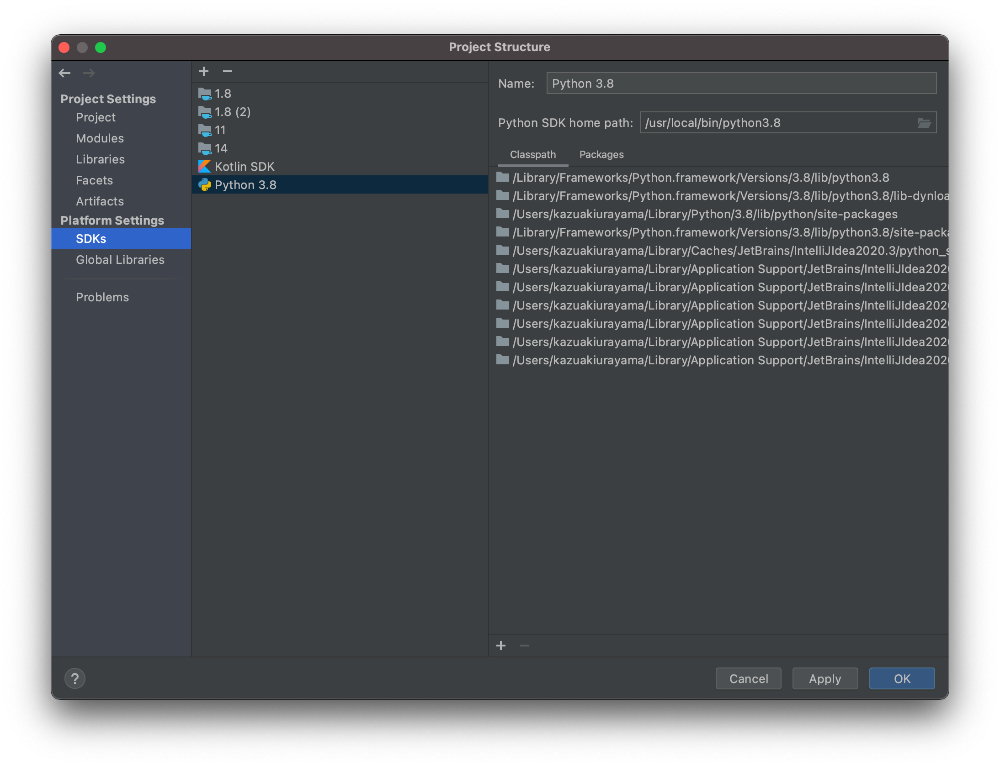
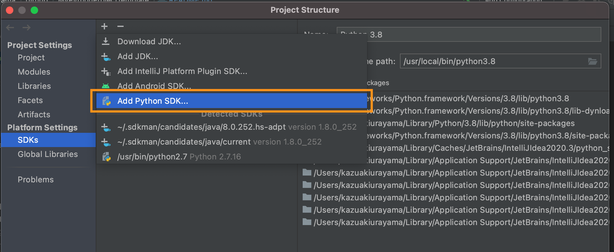
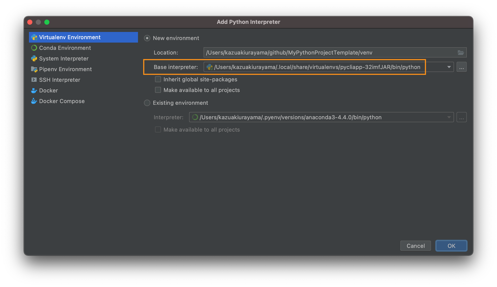
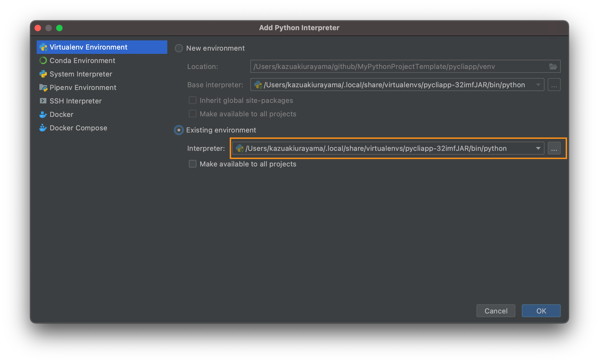

# My Python Project Template

- @author kazurayam
- @date Feb 2021

<!-- START doctoc generated TOC please keep comment here to allow auto update -->
<!-- DON'T EDIT THIS SECTION, INSTEAD RE-RUN doctoc TO UPDATE -->
<details>
<summary>Table of Contents</summary>

- [これは何か](#%E3%81%93%E3%82%8C%E3%81%AF%E4%BD%95%E3%81%8B)
- [前提条件](#%E5%89%8D%E6%8F%90%E6%9D%A1%E4%BB%B6)
- [複数モジュールから成るプロジェクトを作った](#%E8%A4%87%E6%95%B0%E3%83%A2%E3%82%B8%E3%83%A5%E3%83%BC%E3%83%AB%E3%81%8B%E3%82%89%E6%88%90%E3%82%8B%E3%83%97%E3%83%AD%E3%82%B8%E3%82%A7%E3%82%AF%E3%83%88%E3%82%92%E4%BD%9C%E3%81%A3%E3%81%9F)
  - [IntelliJ IDEAでマルチモジュールなプロジェクトを作った](#intellij-idea%E3%81%A7%E3%83%9E%E3%83%AB%E3%83%81%E3%83%A2%E3%82%B8%E3%83%A5%E3%83%BC%E3%83%AB%E3%81%AA%E3%83%97%E3%83%AD%E3%82%B8%E3%82%A7%E3%82%AF%E3%83%88%E3%82%92%E4%BD%9C%E3%81%A3%E3%81%9F)
  - [pycliappの概要](#pycliapp%E3%81%AE%E6%A6%82%E8%A6%81)
  - [pywebappの概要](#pywebapp%E3%81%AE%E6%A6%82%E8%A6%81)
  - [pywebuitestの概要](#pywebuitest%E3%81%AE%E6%A6%82%E8%A6%81)
  - [記号ROOTPROJの定義](#%E8%A8%98%E5%8F%B7rootproj%E3%81%AE%E5%AE%9A%E7%BE%A9)
- [pycliappの説明](#pycliapp%E3%81%AE%E8%AA%AC%E6%98%8E)
  - [Python処理系をmacOSにインストールする](#python%E5%87%A6%E7%90%86%E7%B3%BB%E3%82%92macos%E3%81%AB%E3%82%A4%E3%83%B3%E3%82%B9%E3%83%88%E3%83%BC%E3%83%AB%E3%81%99%E3%82%8B)
    - [pyenvでAnacondaをインストールする](#pyenv%E3%81%A7anaconda%E3%82%92%E3%82%A4%E3%83%B3%E3%82%B9%E3%83%88%E3%83%BC%E3%83%AB%E3%81%99%E3%82%8B)
    - [globalとlocal](#global%E3%81%A8local)
    - [アンインストール](#%E3%82%A2%E3%83%B3%E3%82%A4%E3%83%B3%E3%82%B9%E3%83%88%E3%83%BC%E3%83%AB)
  - [記号 SUBPROJ の定義](#%E8%A8%98%E5%8F%B7-subproj-%E3%81%AE%E5%AE%9A%E7%BE%A9)
  - [pycliappサブプロジェクトのためにPython仮想環境を作る --- pipenv](#pycliapp%E3%82%B5%E3%83%96%E3%83%97%E3%83%AD%E3%82%B8%E3%82%A7%E3%82%AF%E3%83%88%E3%81%AE%E3%81%9F%E3%82%81%E3%81%ABpython%E4%BB%AE%E6%83%B3%E7%92%B0%E5%A2%83%E3%82%92%E4%BD%9C%E3%82%8B-----pipenv)
    - [pipenvをインストールする](#pipenv%E3%82%92%E3%82%A4%E3%83%B3%E3%82%B9%E3%83%88%E3%83%BC%E3%83%AB%E3%81%99%E3%82%8B)
    - [pycliappプロジェクトのために専用のPython仮想環境を作る](#pycliapp%E3%83%97%E3%83%AD%E3%82%B8%E3%82%A7%E3%82%AF%E3%83%88%E3%81%AE%E3%81%9F%E3%82%81%E3%81%AB%E5%B0%82%E7%94%A8%E3%81%AEpython%E4%BB%AE%E6%83%B3%E7%92%B0%E5%A2%83%E3%82%92%E4%BD%9C%E3%82%8B)
    - [外部パッケージを追加する](#%E5%A4%96%E9%83%A8%E3%83%91%E3%83%83%E3%82%B1%E3%83%BC%E3%82%B8%E3%82%92%E8%BF%BD%E5%8A%A0%E3%81%99%E3%82%8B)
    - [開発環境だけで使うパッケージを別枠で管理する](#%E9%96%8B%E7%99%BA%E7%92%B0%E5%A2%83%E3%81%A0%E3%81%91%E3%81%A7%E4%BD%BF%E3%81%86%E3%83%91%E3%83%83%E3%82%B1%E3%83%BC%E3%82%B8%E3%82%92%E5%88%A5%E6%9E%A0%E3%81%A7%E7%AE%A1%E7%90%86%E3%81%99%E3%82%8B)
    - [別マシンでPython仮想環境を再現する手順](#%E5%88%A5%E3%83%9E%E3%82%B7%E3%83%B3%E3%81%A7python%E4%BB%AE%E6%83%B3%E7%92%B0%E5%A2%83%E3%82%92%E5%86%8D%E7%8F%BE%E3%81%99%E3%82%8B%E6%89%8B%E9%A0%86)
    - [Pipfileにスクリプトを登録する](#pipfile%E3%81%AB%E3%82%B9%E3%82%AF%E3%83%AA%E3%83%97%E3%83%88%E3%82%92%E7%99%BB%E9%8C%B2%E3%81%99%E3%82%8B)
    - [仮想環境に入ってシェルを実行する](#%E4%BB%AE%E6%83%B3%E7%92%B0%E5%A2%83%E3%81%AB%E5%85%A5%E3%81%A3%E3%81%A6%E3%82%B7%E3%82%A7%E3%83%AB%E3%82%92%E5%AE%9F%E8%A1%8C%E3%81%99%E3%82%8B)
    - [.envファイルの自動読み込み](#env%E3%83%95%E3%82%A1%E3%82%A4%E3%83%AB%E3%81%AE%E8%87%AA%E5%8B%95%E8%AA%AD%E3%81%BF%E8%BE%BC%E3%81%BF)
    - [Pipfileからrequirements.txtを生成する](#pipfile%E3%81%8B%E3%82%89requirementstxt%E3%82%92%E7%94%9F%E6%88%90%E3%81%99%E3%82%8B)
  - [pycliappプロジェクトのディレクトリ構造を決める](#pycliapp%E3%83%97%E3%83%AD%E3%82%B8%E3%82%A7%E3%82%AF%E3%83%88%E3%81%AE%E3%83%87%E3%82%A3%E3%83%AC%E3%82%AF%E3%83%88%E3%83%AA%E6%A7%8B%E9%80%A0%E3%82%92%E6%B1%BA%E3%82%81%E3%82%8B)
  - [アプリケーションのコードを書く](#%E3%82%A2%E3%83%97%E3%83%AA%E3%82%B1%E3%83%BC%E3%82%B7%E3%83%A7%E3%83%B3%E3%81%AE%E3%82%B3%E3%83%BC%E3%83%89%E3%82%92%E6%9B%B8%E3%81%8F)
  - [ユニットテストのコードを書く](#%E3%83%A6%E3%83%8B%E3%83%83%E3%83%88%E3%83%86%E3%82%B9%E3%83%88%E3%81%AE%E3%82%B3%E3%83%BC%E3%83%89%E3%82%92%E6%9B%B8%E3%81%8F)
  - [srcディレクトリを作ったがうまくいかなかった](#src%E3%83%87%E3%82%A3%E3%83%AC%E3%82%AF%E3%83%88%E3%83%AA%E3%82%92%E4%BD%9C%E3%81%A3%E3%81%9F%E3%81%8C%E3%81%86%E3%81%BE%E3%81%8F%E3%81%84%E3%81%8B%E3%81%AA%E3%81%8B%E3%81%A3%E3%81%9F)
  - [IntelliJ IDEAのなかのPythonプロジェクトに必要な設定をする](#intellij-idea%E3%81%AE%E3%81%AA%E3%81%8B%E3%81%AEpython%E3%83%97%E3%83%AD%E3%82%B8%E3%82%A7%E3%82%AF%E3%83%88%E3%81%AB%E5%BF%85%E8%A6%81%E3%81%AA%E8%A8%AD%E5%AE%9A%E3%82%92%E3%81%99%E3%82%8B)
    - [IDEAにPlatform SDKを追加する](#idea%E3%81%ABplatform-sdk%E3%82%92%E8%BF%BD%E5%8A%A0%E3%81%99%E3%82%8B)
    - [IDEAのプロジェクトにProject SDKを設定する](#idea%E3%81%AE%E3%83%97%E3%83%AD%E3%82%B8%E3%82%A7%E3%82%AF%E3%83%88%E3%81%ABproject-sdk%E3%82%92%E8%A8%AD%E5%AE%9A%E3%81%99%E3%82%8B)
  - [ユニットテストを実行する --- pytest](#%E3%83%A6%E3%83%8B%E3%83%83%E3%83%88%E3%83%86%E3%82%B9%E3%83%88%E3%82%92%E5%AE%9F%E8%A1%8C%E3%81%99%E3%82%8B-----pytest)
- [pywebappの説明](#pywebapp%E3%81%AE%E8%AA%AC%E6%98%8E)
  - [記号 SUBPROJ の定義](#%E8%A8%98%E5%8F%B7-subproj-%E3%81%AE%E5%AE%9A%E7%BE%A9-1)
  - [pywebappプロジェクトのためにPython仮想環境をつくる](#pywebapp%E3%83%97%E3%83%AD%E3%82%B8%E3%82%A7%E3%82%AF%E3%83%88%E3%81%AE%E3%81%9F%E3%82%81%E3%81%ABpython%E4%BB%AE%E6%83%B3%E7%92%B0%E5%A2%83%E3%82%92%E3%81%A4%E3%81%8F%E3%82%8B)
  - [仮想環境にFlaskとpytestをインストールする](#%E4%BB%AE%E6%83%B3%E7%92%B0%E5%A2%83%E3%81%ABflask%E3%81%A8pytest%E3%82%92%E3%82%A4%E3%83%B3%E3%82%B9%E3%83%88%E3%83%BC%E3%83%AB%E3%81%99%E3%82%8B)
  - [Flask Tutorialを写経する](#flask-tutorial%E3%82%92%E5%86%99%E7%B5%8C%E3%81%99%E3%82%8B)
  - [.flaskenvファイルに環境変数の設定を書く](#flaskenv%E3%83%95%E3%82%A1%E3%82%A4%E3%83%AB%E3%81%AB%E7%92%B0%E5%A2%83%E5%A4%89%E6%95%B0%E3%81%AE%E8%A8%AD%E5%AE%9A%E3%82%92%E6%9B%B8%E3%81%8F)
  - [Pipfileにスクリプトを書いて起動を簡単にする](#pipfile%E3%81%AB%E3%82%B9%E3%82%AF%E3%83%AA%E3%83%97%E3%83%88%E3%82%92%E6%9B%B8%E3%81%84%E3%81%A6%E8%B5%B7%E5%8B%95%E3%82%92%E7%B0%A1%E5%8D%98%E3%81%AB%E3%81%99%E3%82%8B)
  - [ユニットテストのカバレージを調べる](#%E3%83%A6%E3%83%8B%E3%83%83%E3%83%88%E3%83%86%E3%82%B9%E3%83%88%E3%81%AE%E3%82%AB%E3%83%90%E3%83%AC%E3%83%BC%E3%82%B8%E3%82%92%E8%AA%BF%E3%81%B9%E3%82%8B)
  - [自作のPythonコードをライブラリ化してPyPIにアップする](#%E8%87%AA%E4%BD%9C%E3%81%AEpython%E3%82%B3%E3%83%BC%E3%83%89%E3%82%92%E3%83%A9%E3%82%A4%E3%83%96%E3%83%A9%E3%83%AA%E5%8C%96%E3%81%97%E3%81%A6pypi%E3%81%AB%E3%82%A2%E3%83%83%E3%83%97%E3%81%99%E3%82%8B)
    - [setup.pyを書く](#setuppy%E3%82%92%E6%9B%B8%E3%81%8F)
    - [requirements.txt を生成する](#requirementstxt-%E3%82%92%E7%94%9F%E6%88%90%E3%81%99%E3%82%8B)
    - [MANIFET.inファイルを書く](#manifetin%E3%83%95%E3%82%A1%E3%82%A4%E3%83%AB%E3%82%92%E6%9B%B8%E3%81%8F)
- [pywebuitestの説明](#pywebuitest%E3%81%AE%E8%AA%AC%E6%98%8E)
- [補足](#%E8%A3%9C%E8%B6%B3)
  - [READMEに目次をつけた](#readme%E3%81%AB%E7%9B%AE%E6%AC%A1%E3%82%92%E3%81%A4%E3%81%91%E3%81%9F)

</details>
<!-- END doctoc generated TOC please keep comment here to allow auto update -->

## これは何か

Pythonはプログラミング言語としてはとても習得しやすい言語だ。 ところがPython言語でプログラムを自作しようと仕事し始めたとたん、さまざまな疑問に遭遇した。Python処理系それ自体をどうインストールするか、特に複数バージョンのPythonを使い分けるにはどうするか、プロジェクトごとさまざまな外部パッケージをどう管理するか、自作したコードをどうやってライブラリ化するか、自作したコードを本番マシンでどうやって配備するか、といった問題だ。開発環境をどう作るか、開発ツールをどう使うか。こうした問題はすでに先人の手で解決済みであってネットを調べれば答えが見つかる。しかしこうしたノウハウを習得するのは容易ではなかった。

Pythonによる開発環境をいかに構築し開発ツールを使うかのお手本となるコード一式を仕込んで、このレポジトリに格納しGit Hubにアップしようと思う。今後自分がさまざまな仕事をPythonで解決しようとするときGit HubのTemplate Repository機能を使ってさっさと環境を構築できるように準備しよう。


## 前提条件

1. 使うマシンはMac Book Air、OSはmaxOS 11.1 Big Sur
1. MacにHomebrewをインストール済み、説明は省略する
1. MacにGitをインストール済み。Git Hubに自分のアカウントを持っている。Gitの操作に熟達していると前提するのでGitに関する説明は省略する。
1. MacでIntelliJ IDEAを統合開発環境として使う。IDEAのライセンスを持っていて、IDEAにPythonプラグインをインストール済み。

## 複数モジュールから成るプロジェクトを作った

一つのシステムを構築するのに複数の技術要素を組み合わせたくなる場合がよくある。その場合、複数のモジュールを一つのGitレポジトリにまとめてバージョン管理したい。

そこで本プロジェクトでは手本として、下記のようにこのレポジトリの中に３つのサブプロジェクトを作って、ひとまとめにバージョン管理することにした。

```
$ tree $ROOTPROJ
.
├── pycliapp
├── pywebapp
└── pywebuitest
```

>なお上記で `ROOTPROJ` という記号を用いていた。これは本レポジトリをわたしのPCのローカルディスクにcloneすることによって作られたディレクトリ（たとえば `~/github/MultipleModulesProjectTemplate`）を表します。

>サブプロジェクトの数は３つとかぎらない、Python言語だけとはかぎらない。サブプロジェクトをJavaやNodeで作ることもあるだろう。

### IntelliJ IDEAでマルチモジュールなプロジェクトを作った

わたしはJavaによる開発のため 統合開発環境 IntelliJ IDEA をずっと使ってきた。だからIDEAでPythonの開発もやることにした。IDEAでひとつの親プロジェクトのなかに複数のサブプロジェクトを持たせたかった。下記の記事を参考にした。

- [IntelliJ IDEAで複数モジュールのプロジェクトを作成する手順のメモ](https://qiita.com/rubytomato@github/items/e534e4f1187801b7e159)

この記事から下記のことを習った。

1. IDEAで$ROOTPROJディレクトリにNew Projectを作るとき **Empty Project** を選択する。
1. IDEAで MultipleModulesProjectTemplate プロジェクトが開いたら、*File > Project Structure* でプロジェクトの構造を設定するダイアログを開く。メニューから *Project Settings > Modules* を選択する。Moduleを＋（追加）する。`pycliapp`モジュールを＋し、`pywebapp`モジュールを＋し、`pywebuitest`モジュールを＋する。これでサブプロジェクトが３つできる。

>ここで「モジュール」という言葉を使ったがこれはIDEAが定義する用語としての「モジュール」である。Python言語が定義する「モジュール」ではない。混同しないよう気をつけよう。Python言語でモジュールとは `myapp.py` のように名前の末尾が `.py` のファイルのことだが、IDEAの用語法はまったく違う。
   
3つのサブプロジェクトはそれぞれどういう内容のプロジェクトか？以下に概要を述べる。

### pycliappの概要

このサブプロジェクトではcommandlineで実行するapplicationをPython言語で開発します。

1. 最初にmacOSにPython処理系をインストールする。[pyenv](https://github.com/pyenv/pyenv) を使って [Anaconda](https://www.anaconda.com/) をインストールする。複数のバージョンのPython処理系をインストールして、切り替えられるようにする。
1. Pythonプロジェクトの標準的なディレクトリ構造を導入します
1. このサブプロジェクトに専用のPython仮想環境を作ります。[pipenv](https://pypi.org/project/pipenv/) を利用します
1. IntelliJ IDEAに適切な設定を加えます。この`pycliapp` プロジェクトの開発作業をIDEAのなかですべてできるようにします
1. コンソールに *Hello, World!* と表示する素朴なアプリケーションをPython言語で作ります
1. アプリケーションをユニットテストします。そのために[pytest](https://docs.pytest.org/en/stable/)を利用します

詳細は[pycliappの説明](#pycliappの説明)を参照のこと

### pywebappの概要

このサブプロジェクトでは WebサーバアプリケーションをPython言語で開発します。

1. フレームワーク [Flask](https://palletsprojects.com/p/flask/) の [チュートリアル](https://flask.palletsprojects.com/en/1.1.x/tutorial/) を隅々まで写経して、ちゃんと動作するWebアプリケーションを作ります。
1. チュートリアルが提供するユニットテストのコードも写経します。Pythonによる上手なコーディング技法の例がテンコ盛りです。
1. 自作したWebサーバアプリを [pip](https://pypi.org/project/pip/) でライブラリ化します。[PyPI](https://test.pypi.org/) にアップロードして共有可能にします。
1. 自作したPythonアプリケーションを組み込んだ[Docker](https://www.docker.com/) イメージを作り、Dockerコンテナを立ち上げて自作アプリを動かします。[Docker Hub](https://hub.docker.com/) にイメージをアップロードして共有可能にします。
1. Flaskチュートリアルのサンプルコードが動くDockerコンテナを自分のPCで立ち上げて、ブラウザで http://localhost:80/ にアクセスできるようにします。

詳細は[pywebappの説明](#pywebappの説明)を参照のこと

### pywebuitestの概要

このサブプロジェクトでpywebappのサーバがブラウザに応答したWebページをテストする自動化テストを開発します。

1. `pywebapp`サブプロジェクトが構築したWebアプリを対象として自動化テストを実行します。
1. [Selenium](https://selenium-python.readthedocs.io/) を用いたPythonプログラムを開発してWebページをテストします。
1. Page Object Model のデザインを用いてテストコードを設計します。

詳細は[pywebuitestの説明](#pywebuitestの説明)を参照のこと

### 記号ROOTPROJの定義

本レポジトリの最上位ディレクトリを作ります。Git Hubからcloneしたなら当然ながらもう出来ているはず。例えば `~/github/MultipleModulesProjectTemplate` ディレクトリを作ったとしましょう。このディレクトリのことを以下の説明文で `$ROOTPROJ` と略記します。下記のようにしてBashシェルに変数 `ROOTPROJ` したと想像してもらってもいい。

```
$ cd ~/github/MultipleModulesProjectTemplate
$ export ROOTPROJ=$(pwd)
$ echo $ROOTPROJ
/Users/myname/github/MultipleModulesProjectTemplate
```

--------------------------------------------------------

## pycliappの説明

概要は[pycliappの概要](#pycliappの概要)を参照のこと。

### Python処理系をmacOSにインストールする

なにはともあれmacOSにPython処理系をインストールした。

#### pyenvでAnacondaをインストールする

この記事を参考にした。

- [【2021年最新版】MacOSで複数のPython/Anacondaバージョンを使い分ける方法【データ分析】](https://www.simpletraveler.jp/2021/01/02/macos-pyenv-python-anaconda-versionmanagement/#pyenvMac)

[pyenv](https://github.com/pyenv/pyenv) はさまざまあるPythonディストリビューションの中から望みのものをインストールしてくれるツール。複数のバージョンのPython処理系をインストールしておいて、切り替えて使うということを可能にしてくれる。

Homebrewを使ってmacOSにpyenvをインストールする。

```
$ cd ~
$ brew install pyenv
```

pyenvのパスをMacの.bash_profileに記述する。

```
export PYENV_ROOT="$HOME/.pyenv"
export PATH="$PYENV_ROOT/bin:$PATH"
eval "$(pyenv init -)"
```

>なおmacOS11ではデフォルトではzshを使うことになっているが、個人的好みでわたしはいまだにbashです。

わたしはDeep Learningに興味があるので Anacondaをインストールしたい。どのバージョンのAnacondaがインストールできるかを調べるにはこうする。

```
$ pyenv install --list | grep anaconda
  ...
  anaconda3-4.4.0
  ...
  anaconda3-5.3.1
  ...
```

たくさんリストアップされた候補の中からanaconda3-4.4.0 と anaconda3-5.3.1 の二つをインストールすることにした。

```
$ pyenv install anaconda3-4.4.0
```

そして

```
$ pyenv install anaconda3-5.3.1
```

>anaconndaディストリビューションは巨大だ。ダウンロードするのに時間がかかる。わたしの環境では10分ぐらいかかった。

コマンドラインで`python`コマンドを投入した時にどのバージョンが使われるかを確認しよう。

```
$ pyenv versions
* system (set by /Users/kazuakiurayama/.pyenv/version)
  anaconda3-4.4.0
  anaconda3-5.3.1
```

これを見ると `system` に `*` がついています。この状態で `python` コマンドを投入すると macOSにプレインストールされたPython2.7が選択され実行されてしまう。これではつまらない。

`pyenv global バージョン`コマンドで設定を切り替えます。今からはanaconda3-4.4.0を使うことにしましょう。

```
$ pyenv global anaconda3-4.4.0
:~
$ pyenv versions
  system
* anaconda3-4.4.0 (set by /Users/kazuakiurayama/.pyenv/version)
  anaconda3-5.3.1
```

#### globalとlocal

なお特定のディレクトリにcdしてから `pyenv local anaconda3-5.3.1` とやればそのディレクトリのしたではglobalに指定したのではない別のPython環境を使うことができます。

#### アンインストール

pyenvでインストールしたバージョンをOSからアンインストールするにはこうします。

```
$ pyenv uninstall バージョン名
```

### 記号 SUBPROJ の定義

TODO

### pycliappサブプロジェクトのためにPython仮想環境を作る --- pipenv

$ROOTPROJディレクトリの直下に `pycliapp` ディレクトリを作ります。`pyclipapp`にカレントディレクトリを移します。`pyclipapp`ディレクトリの絶対パスを SUBPROJ という記号で表すことにします。つまり下記の操作をせよ。

```
$ cd $ROOTPROJ
$ mkdir pycliapp
$ export $SUBPROJ=$(pwd)
```

$SUBPROJディレクトリのなかにPython仮想環境を作りましょう。pipenvを使います。[pipenv](https://pypi.org/project/pipenv/) はPython仮想環境を作るツールです。下記の記事を参考にした。

- [Pipenvを使ったPython開発まとめ](https://qiita.com/y-tsutsu/items/54c10e0b2c6b565c887a)

#### pipenvをインストールする

pyenvで選択したバージョンのanacondaにpipenvをインストールします。・・・たぶんもう入っているんですがねんのため。

```
$ cd ~
$ pip install pipenv
```
#### pycliappプロジェクトのために専用のPython仮想環境を作る

$SUBPROJにcdします。そして下記のコマンドを投入する。

```
$ cd $SUBPROJ
$ pipenv --python 3
```

すると仮想環境が作られます。

```
Creating a virtualenv for this project...
Pipfile: /Users/myname/github/MultipleModulesProjectTemplate/pycliapp/Pipfile
Using /usr/local/bin/python3.8 (3.8.5) to create virtualenv...
⠋ Creating virtual environment...created virtual environment CPython3.8.5.final.0-64 in 549ms
  creator CPython3Posix(dest=/Users/myname/.local/share/virtualenvs/pycliapp-TkLJRwmc, clear=False, no_vcs_ignore=False, global=False)
  seeder FromAppData(download=False, pip=bundle, setuptools=bundle, wheel=bundle, via=copy, app_data_dir=/Users/myname/Library/Application Support/virtualenv)
    added seed packages: pip==21.0.1, setuptools==52.0.0, wheel==0.36.2
  activators BashActivator,CShellActivator,FishActivator,PowerShellActivator,PythonActivator,XonshActivator

✔ Successfully created virtual environment! 
Virtualenv location: /Users/myname/.local/share/virtualenvs/pycliapp-TkLJRwmc
Creating a Pipfile for this project...
```


このとき $SUBPROJディレクトリの下に [Pipfile](pycliapp/Pipfile) というファイルが生成されます。Pipfileの中をみると、AnacondaにインストールされていたPython3.xが選ばれて、それを使うように仮想環境が初期化されたことがわかります。


pycliappプロジェクトのために作ったこのPython仮想環境がじっさいにどこのディレクトリに作られたのか？下記のコマンドで調べることができます。

```
$ cd $SUBPROJ
$ pipenv --venv
/Users/myname/.local/share/virtualenvs/pycliapp-TkLJRwmc
```
$SUBPROJディレクトリの下ではなくてぜんぜん別の場所に作られたことに注目しましょう。仮想環境を構成するファイル群はGitによるバージョン管理に含めるべきでありません。だから$SUBPROJディレクトリではない別の場所に仮想環境が作られるのは好都合です。

あとでIntelliJ IDEAにPlatform SDKを追加するとき、`pipenv --env`が教えてくれたパスを指定することになります。

#### 外部パッケージを追加する

pycliappプロジェクトのなかであとでユニットテストをします。pytestを使います。pycliappプロジェクトのPython仮想環境のなかにpytestをインストールしましょう。

```
$ cd $SUBPROJ
$ pipenv install pytest

Installing pytest...
Adding pytest to Pipfile's [packages]...
✔ Installation Succeeded 
Pipfile.lock not found, creating...
Locking [dev-packages] dependencies...
Locking [packages] dependencies...
Building requirements...
Resolving dependencies...
✔ Success! 
Updated Pipfile.lock (a834da)!
Installing dependencies from Pipfile.lock (a834da)...
  🐍   ▉▉▉▉▉▉▉▉▉▉▉▉▉▉▉▉▉▉▉▉▉▉▉▉▉▉▉▉▉▉▉▉ 0/0 — 00:00:00
To activate this project's virtualenv, run pipenv shell.
Alternatively, run a command inside the virtualenv with pipenv run.
```

[Pipfile](pycliapp/Pipfile)のなかに `[package]`という記述ができて、そのなかに `pipenv` が自動的に追加されます。

```
[packages]
pytest = "*"
```

また $SUBPROJディレクトリの下に `Pipfile.lock` ファイルが自動的に追加されます。

```
$ cd $SUBPROJ
$ ls .
Pipfile		Pipfile.lock	pycliapp.iml
```

#### 開発環境だけで使うパッケージを別枠で管理する

アプリケーションが依存する通常の外部パッケージではなくて、開発環境でだけ使うパッケージを別枠として管理することができあす。たとえば [`autopep8`](https://githubja.com/hhatto/autopep8) をインストールしてみよう。

```
$ cd $SUBPROJ
$ pipenv install --dev autopep8
```

するとPipfileが次のように更新される。

```
[dev-packages]
autopep8 = "*"
```

#### 別マシンでPython仮想環境を再現する手順

`Pipfile` と `Pipfile.lock`　には、`pipenv install`コマンドによって仮想環境に追加されたパッケージに関する詳細情報が記録されています。このふたつのファイルさえあればpycliappプロジェクトの仮想環境とまったく同じものを別のマシンで再現することが簡単にできます。だから`Pipfile`と`Pipfile.lock`ファイルをかならずGitレポジトリに追加して共有します。

別マシンにこのレポジトリをcloneしたあとでPython仮想環境を再現するにはこうします。

Pipfileを入力としてパッケージを再インストールするにはこうする。

```
$ cd $SUBPROJ
$ pipenv install
$ pipenv install --dev
```

`pipenv install`コマンドの場合、外部パッケージのバージョンがきっちり同じになるとはかぎらない。コマンドを実行した時点で最新のバージョンが選ばれてインストールされるかもしれません。

Pipfile.lockを入力として外部パッケージの詳細なバージョンもきっちりあわせて環境を再現するにはこうする。

```
$ cd $SUBPROJ
$ pipenv sync
$ pipenv sync --dev
```

#### Pipfileにスクリプトを登録する

Pipefileの `[scripts]` に短いシェルスクリプトを記述し名前をつけて登録することができます。たとえば プロダクトのmainスクリプトを起動する、ユニットテストを実行する、Pythonコードを生成する、Lintツールを実行する、など頻繁に実行するコマンドを登録しておけば便利です。

```
[scripts]
test = "python -m pytest"
format = "autopep8 -ivr ."
```

testスクリプトを実行するにはこうします。

```
$ cd $SUBPROJ
$ pyenv run test
```

#### 仮想環境に入ってシェルを実行する

pycliappプロジェクト専用のPython仮想環境に入ってコマンドライン操作をするには `pipenv shell` を使う。

```
$ cd $SUBPROJ
$ pipenv shell
Launching subshell in virtual environment...
 . /Users/myname/.local/share/virtualenvs/pycliapp-32imfJAR/bin/activate
:~/github/MyPythonProjectTemplate/pycliapp (master *)
$  . /Users/myname/.local/share/virtualenvs/pycliapp-32imfJAR/bin/activate
(pycliapp) :~/github/MyPythonProjectTemplate/pycliapp (master *)
```
仮想環境のシェルから出るには `exit` する。
```
$ exit
```

#### .envファイルの自動読み込み

プロジェクトに [`.env`](pycliapp/.env) ファイルを作っておくと `pipenv run` や `pipenv shell` を実行するときに自動で読み込んでくれる。認証情報などプログラムのソースにハードコードするにはまずい情報を登録しておくのに便利。ただし `.gitignore` に `.env` を書いてレポジトリから除外するのを忘れずに。

pycliapp/.envの例
```
username=John Doe
password=ThisIsNotAPassword
DEBUG=1
```

こうすると環境変数 `DEBUG` ができて値に `1` が設定されます。確認してみよう。

```
$ cd $SUBPROJ
$ pipenv run python
Loading .env environment variables...
Python 3.8.5 (v3.8.5:580fbb018f, Jul 20 2020, 12:11:27) 
[Clang 6.0 (clang-600.0.57)] on darwin
Type "help", "copyright", "credits" or "license" for more information.
>>> import os
>>> os.environ['DEBUG']
'1'

```

#### Pipfileからrequirements.txtを生成する

わたしは pipenvを使って外部パッケージをインストールしました。その詳細は Pipfile や Pipfile.lock に保存されています。ところであとでpywebappサブプロジェクトで自作のPythonコードをライブラリにしますが、そこで [`requirements.txt`](pycliapp/requirements.txt) が必要になります。requirements.txtは外部依存パッケージを列挙したもの。わざわざ requirements.txt を二度手書きしたくない。そこでPipfileに列挙された情報を変換してrequirements.txtに書き出すことができます。

```
$ cd $SUBPROJ
$ pipenv run pip freeze > requirements.txt
```

このテクニックを使えば外部依存ライブラリの管理をPipenvに一元化し、requirements.txtファイルを手書きするのを避けつつ、pipコマンドでライブラリ化することができます。

### pycliappプロジェクトのディレクトリ構造を決める

では アプリケーションのPythonコードを書こう。ユニットテストするためのPythonコードも書こう。そのためにプロジェクトのディレクトリ構造を決めた。

```
$ cd $SUBPROJ
$ tree .
.
├── mypkg
│   ├── __init__.py
│   └── greeting.py
└── tests
    ├── __init__.py
    └── test_greeting.py
```

pycliappディレクトリの直下に `mypkg` ディレクトリを作りました。その下に `__init__.py` ファイルを作った。`__init__.py` を配置したことで `mypkg` がPython言語の言葉遣いでいうところの「パッケージ」になります。`mypkg`ディレクトリの下に `greenting.py` ファイルを作りました。このPythonファイルのなかにアプリケーションのコードを記述していきます。これで `mypkg`パッケージのなかに `greeting` モジュールを作ったことになります。

またpycliappディレクトリの直下に `tests` ディレクトリを作りました。`tests`ディレクトリの下に `test_greeting.py` ファイルを作りました。ここにユニットテストをするためのコードを記述していきます。

```
from mypkg import greeting
```

### アプリケーションのコードを書く

[pycliapp/mypkg/greeting.py](pycliapp/mypkg/greeting.py) のコードは下記のようなシンプルなものです。

```
def hello(name):
    return f"Hello, {name}!"
```

### ユニットテストのコードを書く

[pycliapp/tests/test_greeting.py](pycliapp/tests/test_greeting.py) のコードは下記のとおりです。

```
from mypkg import greeting

def test_hello():
    assert greeting.hello('World') == 'Hello, World!'
```

### srcディレクトリを作ったがうまくいかなかった

ここですこし脇道にそれます。プロジェクトのディレクトリ構造を決めるにあたってわたしが迷って困ったという話をします。

わたしは pycliappディレクトリの下に `src` ディレクトリを配置し、`src`の下にPythonパッケージとしてのディレクトリ `mypkg` を配置したいと考えました。

```
$ tree .
.
├── src
│   └── mypkg
│       ├── __init__.py*__*
│       └── greeting.py
└── tests
 ├── __init__.py
 └── test_greeting.py
```

なぜ？ --- わたしはJavaプログラミングの経歴が長い。Mavenや[Gradleの流儀](https://docs.gradle.org/current/userguide/organizing_gradle_projects.html#sec:separate_language_source_files) どおりに、プロジェクトの最上位ディレクトリの下に `src` があるというディレクトリ構造に馴染んでいた。だから `src` が無いのが気に入らなかったからです。 

ところがPythonプロジェクトの直下に `src` ディレクトリを作ろうとしてたくさんの問題に遭遇しました。どんな問題が起きたか？ たくさんあるのですが、ふたつメモしておきましょう。

第一に pytest。[`pycliapp/tests/test_greeting.py`](pycliapp/tests/test_greeting.py)の一行目に `from mypkg import greeting` と書きました。これはどうしても必要な記述です。ところが `src` ディレクトリがあるとこの`from`がエラーになってしまった。衆知のとおりPython処理系は外部パッケージをみつけるとき [`sys.path`](https://qiita.com/fumitoh/items/7999ec8aac5f63c9fa18) 変数に列挙されたディレクトリ群のなかを探索します。sys.pathの設定が不備だと`from`がエラーになる。さて、どうしよう。いろいろ調べてひねり技をこらした。ドキュメント [pytest import mechanisms and sys.path/PYTHONPATH](https://docs.pytest.org/en/stable/pythonpath.html) に従って `conftest.py` を作った。また IDEAのModulesの設定ダイアログで srcディレクトリに *Sources* のマークをつけた。などなど。あとでわかったのだが、`src`ディレクトリ無しに`mypkg`をプロジェクト直下におけばこんなひねり技は不要。なぜなら `sys.path` にはカレントディレクトリが含まれるから。

第二に Waitress。わたしは pywebappサブプロジェクトでFlaskフレームワークをベースとするWebアプリケーション flaskr を作った（正しくはTutorialのサンプルコードを写経しました）。そしてWebサーバ "Waitress" をコマンドラインで起動してそのなかで flaskr を動かそうとした。flaskr のPythonソースコードが srcディレクトリの下にあることを Waitress に教える必要があった。しかしその方法がついにわからなかった。[ドキュメント](https://docs.pylonsproject.org/projects/waitress/en/stable/runner.html) をみると "As of 0.8.6, the current directory is automatically included on sys.path."と書いてあった。つまりアプリケーションのパッケージがカレントディレクトリの直下にあれば問題は起きない。しかし `src` ディレクトリがあるとsys.pathのなかでアプリケーションのディレクトリが見つからなくなってしまう。Waitress は Pythonアプリがカレントディレクトリにあるという標準的なディレクトリ構造を前提していて、`src`ディレクトリが挟まっているイレギュラーなディレクトリ構造を想定していない。ここで手詰まりになった。

結論：　Python世界ではプロジェクトの最上位ディレクトリの直下にアプリケーションのパッケージとしてのディレクトリ（たとえば `mypkg`）を配置するディレクトリ構造を採用すべきです。それ以外のディレクトリ構造にすると面倒がおきるばかり。やめておきましょう。


### IntelliJ IDEAのなかのPythonプロジェクトに必要な設定をする

このレポジトリをIntelliJ IDEAでEmpty Projectとして作り、そのなかに包含される形で pycliapp をはじめとする３つのディレクトリをつくりました。IDEA用語でいえば「モジュール」を３つ作りました。そのあとコマンドラインで pipenvコマンドを実行して pycliappモジュール専用のPython仮想環境をつくりpytestなど外部依存ライブラリをインストールしました。ところがまだIDEAにはまだなんの設定も加えていません。だからIDEAでpycliappモジュールを開いたときにそれ専用の仮想環境を使うように設定できていません。

Anacondaにはnumpyを膨大な数のライブラリがすでにバンドルされています。pytestもバンドルされています。ところがあとで pywebuitestプロジェクトが使う [selenium](https://selenium-python.readthedocs.io/) はAnacondaに含まれていません。だからサブプロジェクト専用のPython仮想環境に selenium を追加インストールするでしょう。そしてIDEAでpywebuitestを開いたときに専用の仮想環境を指定してプロジェクトを実行できるよう設定しておく必要があります。

IDEAでPythonモジュールの処理系を設定する作業は二段階を踏みます。第一に 仮想環境を追加するたびに、IDEAにとってPlatform SDK のひとつとして登録してやります。第二に pycliappはじめ各プロジェクトにたいして Project SDKとしてPlatform SDKをひとつ選択してアサインします。各プロジェクト専用に準備した仮想環境を正しく選択して各プロジェクトのProject SDKにアサインします。

#### IDEAにPlatform SDKを追加する


IDEAを起動しMyPythonProjectTemplateプロジェクトを開きます。*File > Project Structure...* を選択する。ダイアログの左メニューから *Platform Settings > SDKs* を選択する。ここには pycliappプロジェクト専用のPython仮想環境がSDKとしてまだ登録されていません。



＋アイコンをクリックして*Add Python SDK*のメニューを選択します。



この *Add Python Interpreter* ダイアログのなかに

- New Environment
- Existing Environment

のふたつの選択肢があることに注意せよ。New Environmentを選ぶとIDEAにたいしてPython仮想環境を新規に作れと要求することになる。しかしわれわれはコマンドラインで pipenv コマンドを用いて pycliappプロジェクト専用を仮想環境をすでに作成ずみだ。だからわれわれは Existing Evironmentのほうを選択すべきだ。

pycliappプロジェクト専用に作ったPython仮想環境をPlatform SDKとしてIDEAに追加登録したいのですが、そのためにはその仮想環境のパスを調べておく必要があります。次のコマンドで調べられます。

```
$ cd $SUBPROJ
$ pwd
/Users/myname/github/MyPythonProjectTemplate/pycliapp
$ pipenv --venv
/Users/myname/.local/share/virtualenvs/pycliapp-32imfJAR
```

*Existing Environment* の *Interpreter* に、Python仮想環境のディレクトリのなかにある pythonのバイナリのパスを入力します。



OKするとIDEAが数秒走って `Python 3.8 (pycliapp-32imfJAR)` みたいなという名前でPlatform SDKが追加されます。この名前ではどのプロジェクトのためにつくったものなのかわからない。`Python 3.8 (MyPythonProjectTemplate-pycliapp)` という名前に変更しておきましょう。

#### IDEAのプロジェクトにProject SDKを設定する

つぎに pycliappモジュールが参照すべきSDKを設定します。

*Files > Project Structure...* でダイアログを開き、左メニューで *Project Settings > Modules*を選ぶ。するとこのプロジェクトのなかに含まれている３つのモジュール (pycliapp、pywebapp、pywebuitest)が一覧に表示される。pycliappモジュールをクリックして選択します。そして *Module SDK* として上記で追加した `Python 3.8 (MyPythonProjectTemplate-pycliapp)`を設定します。



OKしましょう。これでIDEAの設定はできました。

### ユニットテストを実行する --- pytest

ユニットテストを実行する準備が整いました。pytestを起動するにはこうする。

```
$ cd $SUBPROJ
$ pipenv run pytest
```

テストが動いてpassしました。

```
Loading .env environment variables...
============================= test session starts ==============================
platform darwin -- Python 3.8.5, pytest-6.2.2, py-1.10.0, pluggy-0.13.1
rootdir: /Users/kazuakiurayama/github/MyPythonProjectTemplate/pycliapp
collected 1 item                                                               

tests/test_greeting.py .                                                 [100%]

============================== 1 passed in 0.01s ===============================
```

以上で pycliappプロジェクトが完成しました。

---------------------------------------------------------
## pywebappの説明

概要は[pywebappの概要](#pywebappの概要)を参照のこと。

pywebappプロジェクトはWebサーバアプリケーションを開発します。

Python処理系のインストール、プロジェクトのディレクトリ構造の決定、仮想環境の作成、IntelliJ IDEAの設定、pytestによるユニットテスト --- これらの手順は前述の pycliapp と同様です。

pipで自作Pythonコードをライブラリ化する手順については下記の記事を参考にしました。

- [あとで後悔しないPythonのディレクトリ構成をつくってみる](https://qiita.com/kobori_akira/items/aa42790354654debb655)

### 記号 SUBPROJ の定義

```
$ cd ~/github/MyPythonProjectTemplate/pywebapp
$ export SUBPROJ=$(pwd)
```

### pywebappプロジェクトのためにPython仮想環境をつくる

pywebapp/Pipfileが無い状態ではじめて仮想環境を作るならこうする

```
$ cd $SUBPROJ
$ pipenv --python 3
```

GitレポジトリからPipfileを取り出してあったなら、Pipfileから仮想環境を再現することができる。

```
$ cd $SUBPROJ
$ pipenv install
$ pipenv install --dev
```

### 仮想環境にFlaskとpytestをインストールする

```
$ cd $SUBPROJ
$ pipenv install flask pytest
```

### Flask Tutorialを写経する

Flaskの公式ドキュメントのチュートリアルのサンプルコードをそのまま写経しました。

- [Tutorial](https://flask.palletsprojects.com/en/1.1.x/tutorial/)

このコードについてわたしが付け加えることはありません。ユニットテストのサンプルコードがいい。decoratorなどPython言語の玄人っぽい書き方が勉強になります。

pywebappプロジェクトでユニットテストを実行します。

```
$ cd $SUBPROJ
$ pipenv run pytest
```

パスしなかったらひとつひとつ間違いを修正しましょう。 パスしたらこんなふうになります。

```
============================= test session starts ==============================
platform darwin -- Python 3.8.5, pytest-6.2.2, py-1.10.0, pluggy-0.13.1
rootdir: /Users/kazuakiurayama/github/MyPythonProjectTemplate/pywebapp
collected 24 items

tests/test_auth.py ........                                              [ 33%]
tests/test_blog.py ............                                          [ 83%]
tests/test_db.py ..                                                      [ 91%]
tests/test_factory.py ..                                                 [100%]

============================== 24 passed in 1.06s ==============================
```


### .flaskenvファイルに環境変数の設定を書く

Flaskを起動するとき環境変数 `FLASK_APP` ほかを指定しなければならない。コマンドラインの引数として指定することもできるが面倒だ。[https://www.pgen.info/archives/1691](https://www.pgen.info/archives/1691)によれば、`.flaskenv` ファイルを作ってそこに環境変数の定義を書けばいい。

- [pywebapp/.flaskenv](pywebapp/.flaskenv)

python-dotenvが必要なのでインストールする。

```
$ cd $SUBPROJ
$ pipenv install python-dotenv
```

### データベースを初期化する

flaskrは内部でsqlite3データベースを使います。Webサーバを立ち上げる前にデータベースのためにストレージを初期化する必要があります。初期化のスクリプト init-db をTutorialのなかで開発ずみなので、それを実行します。

```
$ cd $SUBPROJ
$ pipenv run flask init-db
Initialized the database
```


### Webサーバを起動する

さあ、Webサーバを立ち上げてみましょう。

```
$ pipenv run flask run
 * Serving Flask app "flaskr" (lazy loading)
 * Environment: development
 * Debug mode: on
 * Running on http://127.0.0.1:5000/ (Press CTRL+C to quit)
 * Restarting with stat
 * Debugger is active!
 * Debugger PIN: 117-336-445

```

ブラウザで http://127.0.0.1:5000/ にアクセスすればこのサーバにアクセスすることができます。


### Pipfileにスクリプトを書いて起動を簡単にする

[Pipfile](pywebapp/Pipfile) にflaskrunという名前のスクリプトを書いた。Flaskを起動するコマンドだ。

```
$ cd $SUBPROJ
$ pipenv run flaskrun
```

もしも`flask run`コマンドに引数を追加しなければならなくなったとき、スクリプトに引数を書いておくことができるので便利だ。

### ユニットテストのカバレージを調べる

ユニットのテストのカバレージを調べよう。coverageをインストールする。

```
$ cd $SUBPROJ
$ pipenv install --dev coverage
```

coverageを実行する

```
$ cd $SUBPROJ
$ pipenv run coverage run -m pytest

```

coverageのレポートをみる

```
$ cd $SUBPROJ
$ pipenv run coverage report
Name                                                                                                                                    Stmts   Miss  Cover
-------------------------------------------
flaskr/__init__.py                                                                                                                         23      0   100%
flaskr/auth.py                                                                                                                             59      0   100%
flaskr/blog.py                                                                                                                             58      0   100%
flaskr/db.py                                                                                                                               25      0   100%
tests/__init__.py                                                                                                                           0      0   100%
tests/conftest.py                                                                                                                          34      0   100%
tests/test_auth.py                                                                                                                         30      0   100%
tests/test_blog.py                                                                                                                         59      0   100%
tests/test_db.py                                                                                                                           19      0   100%
tests/test_factory.py                                                                                                                       7      0   100%
-------------------------------------------
TOTAL                                      
```

coverageにHTML形式のレポートを生成させるにはこうする。

```
$ cd $SUBPROJ
$ pipenv run coverage html

```

### 自作のPythonコードをライブラリ化してPyPIにアップする

#### setup.pyを書く


自作のPythonコードをライブラリ化するに [pywebapp/setup.py](pywebapp/setup.py) を書く。

PyPIにファイルをアップしたときに他の人がつくったものと重複しないユニークな名前をライブラリに与える必要がある。`flaskr`だけではきっとかぶってしまう。そこで`flaskr-kazurayam`という名前にした。これならかぶらない。
```
setup(
    name="flaskr-kazurayam",
```

#### requirements.txt を生成する

pipコマンドがライブラリを作成するときそれがどの外部ライブラリに依存するかという情報を `requirements.txt` ファイルから読み取る。われわれはpipenvを使って外部ライブラリをインストールしたから、`Pipfile`から`requirements.txt`を自動生成することができる。こうする。

```
$ cd $SUBPROJ
$ pipenv run pip freeze > requirements.txt
```

#### MANIFET.inファイルを書く

ライブラリが依存するrequirements.txtの場所をpipに教えるために `MANIFEST.in` ファイルを準備する必要がある。さらにflaskrはSQL文やTemplateを含める必要があった。Tutorialが示してくれたMANIFEST.inを写経した。

- [pywebapp/MANIFEST.in](pywebapp/MANIFEST.in)


#### ディストリビューションを作成する

Pythonライブラリを作る第一のやり方は`python setup.py sdist` だ。sdistとはsouce distributionのこと。その名の通りPythonのソースコードを配布する。

```
$ cd $SUBPROJ
$ pipenv run python setup.py sdist
```

sdistの場合、利用者が pip install xxxxxx を実行すると利用者側でsetup.pyの記述に基づいたビルド処理が実行される。このビルド処理が失敗しがちだ。理由はさまざまある。たとえばPython言語ではなくC言語で記述されたコードがライブラリに含まれていたりするとWindowsではきっと失敗する。ソースコードを配布するのではなくビルド済みのパッケージを配布するやり方があればそっちのほうが良い。そこで利用されるのが [wheel](https://pythonwheels.com/)。

pywebappでもwheelを利用しよう。

まずwheelをインストールする。

```
$ cd $SUBPROJ
$ pipenv install --dev wheel
```

wheelをインストールすると `bdist_shell` が使えるようになる。`sdist`ではなくこっちでライブラリ化する。

```
$ cd $SUBPROJ
$ pipenv run python setup.py bdist_wheel
```

すると

```
$ cd $SUBZPROJ
$ ls dist
flaskr_kazurayam-1.0.3-py3-none-any.whl
```

このとおり、distディレクトリのなかに名前の末尾が `.whl` のファイルができた。 flask_kazurayam のライブラリが作られました。


#### SECRET_KEYについて

[Flask Tutorial / Deploy to Production](https://flask.palletsprojects.com/en/1.1.x/tutorial/deploy/) に **Configure the Secret Key** と題する節がある。Flaskがセッション情報を暗号化するのに使う秘密鍵 Secret Key を指定する必要があって、[`flaskr/__init__.py`](pywebapp/flaskr/__init__.py) に或る固定文字列がデフォルト値として書いてある。開発者が自分のマシンでローカルにFlaskアプリを立ち上げてデバッグする場面ならデフォルト値にままでかまわない。しかしインターネットから不特定多数からのアクセスに晒される本番環境を構築する場面ではSECRET_KEYを変更しなければならない。どうやればいいのか？

Tutorialの記述を読んでもよくわからなかった。sqlite3のデータベースが venv/var/flaskr-instance というディレクトリの中に作られると書いてるが、なんだそりゃ？venv/var/flaskr-instance/config.py というファイルを作ってその中にSECRET_KEYを指定せと記述されてるが、Dockerコンテナ常にconfig.pyを生成するようにDockerfileを記述するのか？ううむ、わからない。

本番環境をどう作るについて試行錯誤して習うことがまだたくさんある。また後日。

#### Waitress

`flask`コマンドで立ち上がるHTTPサーバは動作が遅いらしい。チュートリアルは [Waitress](https://docs.pylonsproject.org/projects/waitress/en/stable/runner.html) を紹介している。日本語に記事があった。

- [bottle.py+waitressでPython飲みで動作可能なWebサーバ](https://qiita.com/yoichiwo7/items/abcd87c8a8a2e027fc12)

waitressをインストールしよう。
```
$ cd $SUBPROJ
$ pipenv install waitress
```

外部依存ライブラリが増えたから requirements.txt ファイルも更新しておこう。

```
$ cd $SUBPROJ
$ pipenv run pip freeze > requirements.txt
```

`waitress-serve --call モジュール名:オブジェクト名`でwebサーバを起動する。

```
$ cd $SUBPROJ
$ pipenv run waitress-serve --port=5000 --call 'flaskr:create_app'
Serving on http://0.0.0.0:5000
```

Ctrl+Cでwaitress-serveを停止する。

#### PyPIにアップロードする

ライブラリのファイルを [テスト用のPyPI](https://test.pypi.org/) にアップロードして共有可能します。


### Dockerイメージをつくる、Dockerコンテナを起動する

さらにDockerイメージを作って[Docker Hub](https://hub.docker.com/) にアップロードして共有可能にします。Docker http://localhost:80/ でアクセス

---------------------------------------------------------
## pywebuitestの説明

概要は[pywebuitestの概要](#pywebuitestの概要)を参照のこと。


---------------------------------------------------------
## 補足

### READMEに目次をつけた

[GitHubの本プロジェクトのREADME](https://github.com/kazurayam/MultipleModulesProjectTemplate) に目次(Table of Contents)をつけた。下記のページを参考にして実現した。

- [[GitHub]README.mdの目次生成をAction「toc-generator」による自動化で楽しよう](https://dev.classmethod.jp/articles/auto-generate-toc-on-readme-by-actions/)
